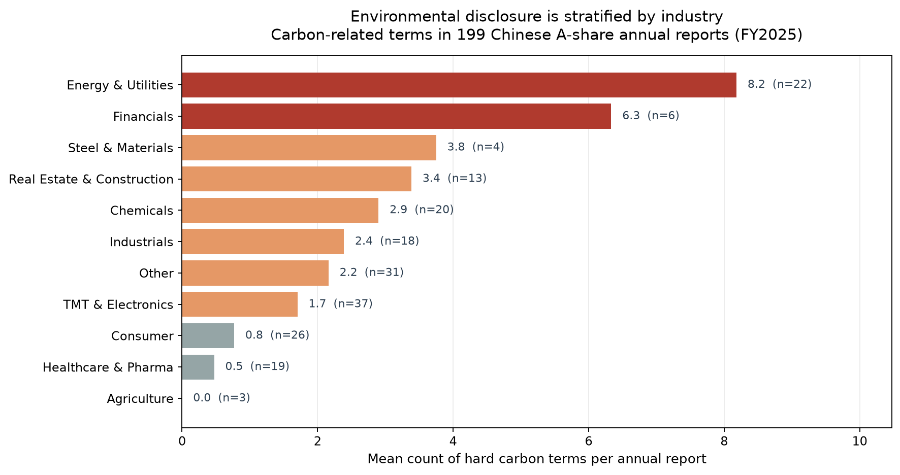
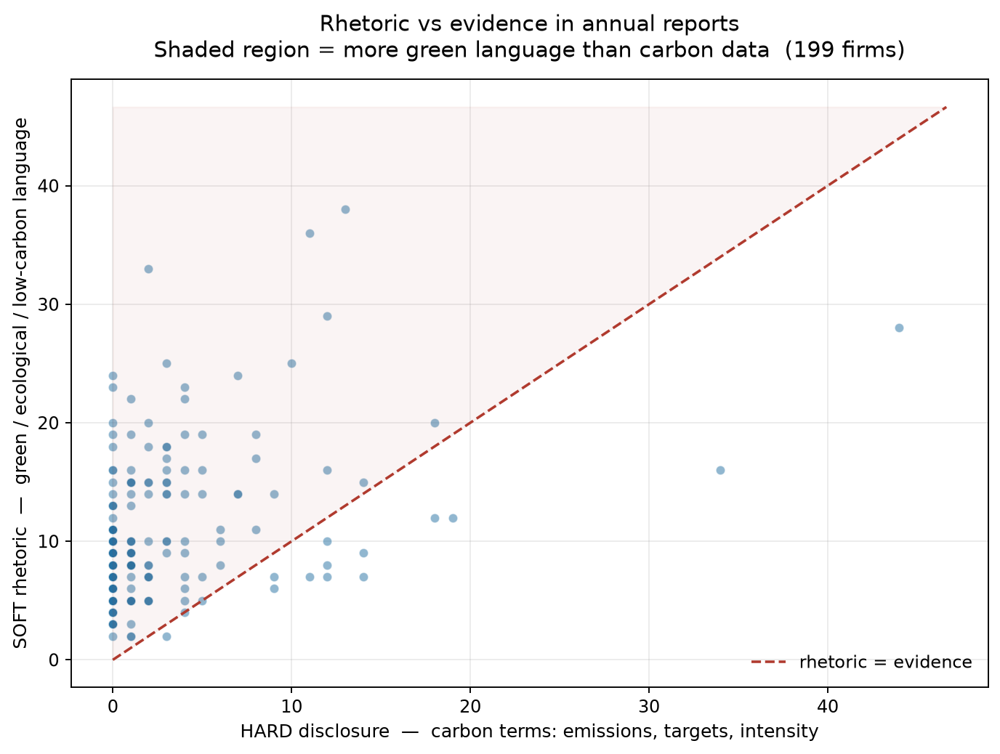
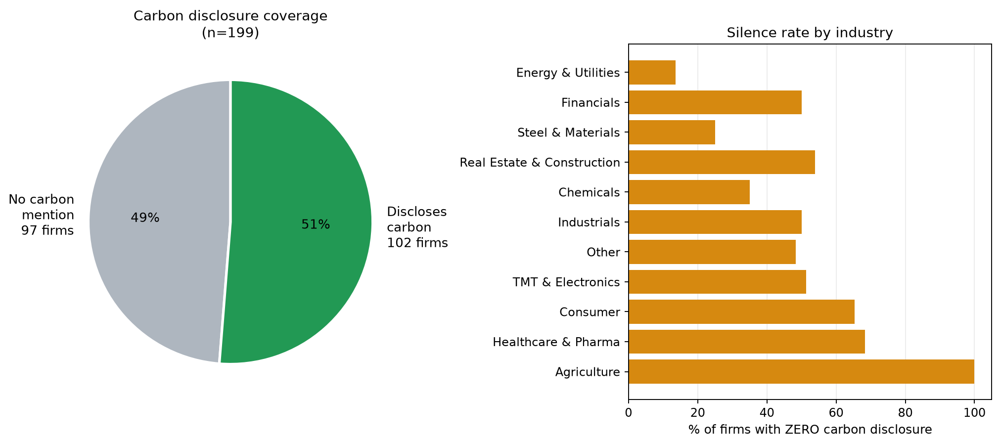

# 绿色话术，沉默的碳数据

### 199 份中国 A 股年报里的环境披露结构

**[English](README.en.md)** | **中文**

> **一句话结论** — 我抓取并文本挖掘了官方巨潮资讯网上的 **199 份年报**。一半的中国上市公司
> 从不提"碳"，只有 **2%** 给出具体数字。环境披露并非普遍性漂绿，而是**随行业急剧分层**，
> 而最沉默的行业，恰恰是最有动机显得环保的那些。

**[📄 阅读完整论文 →](report/working_paper.md)**　·　**[🔧 技术手册 →](report/technical_manual.md)**

---

## 核心发现

| 发现 | 数字 |
|---|---|
| **完全不提"碳"**的公司 | **97 / 199（49%）** |
| 给出**具体碳排放数值**的公司 | **4 / 199（2%）** |
| 谈绿色理念但**零碳数据**的公司 | **97 / 199（49%）** |
| 碳提及次数 — 能源电力（均值） | **8.2** |
| 碳提及次数 — 医药生物（均值） | **0.5** |
| 碳提及次数 — 农林牧渔（均值） | **0.0** |

### 图 1 — 披露随行业分层，而非普遍漂绿


### 图 2 — 话术 vs 证据


### 图 3 — 覆盖率与沉默率


---

## 为什么这个发现重要

全球气候披露规则正在收紧——欧盟 CSRD、英国 FCA 反漂绿规则、港交所正在分阶段落地的
ISSB 对齐要求。它们都默认企业**拥有**环境数据，监管的任务只是让企业如实披露。

本项目检验了这个前提。结论是：**真正的约束不是说谎，而是缺失。** 大多数中国年报里
根本没有环境数据——所以常见的"漂绿"叙事，其实误描述了问题的性质。

---

## 流水线

| 步骤 | 脚本 | 作用 | 耗时 |
|---|---|---|---|
| 1 | `src/01_harvest.py` | 从巨潮 API 采集年报索引 | ~15 秒 |
| 2 | `src/02b_extract_full.py` | 并行下载 PDF、全文抽取、计算披露得分 | ~10 分钟 |
| 3 | `src/04_industry.py` | 补充官方行业分类（东财 `f127`） | ~30 秒 |
| 4 | `src/03_analyze.py` | 按行业汇总、生成图表与 summary JSON | ~5 秒 |

```bash
python -m venv .venv && source .venv/bin/activate
pip install -r requirements.txt

python src/01_harvest.py 14      # 14 页 -> 199 家公司
python src/02b_extract_full.py   # 并行下载 + 全文打分
python src/04_industry.py        # 官方行业分类
python src/03_analyze.py         # 图表 + 汇总
```

**全流程约 12 分钟。** 需要 Python 3.9+，以及能访问 `cninfo.com.cn` 的网络
（东财行业接口经由 `push2delay` 访问）。

---

## 方法

对每份年报的**全文**按三个关键词族打分：

| 类别 | 词表 | 含义 |
|---|---|---|
| **硬披露** | 碳排放, 碳达峰, 碳中和, 温室气体, 碳强度, 碳配额 | 具体的碳计量/目标 |
| **行动** | 减排, 节能, 污染治理, 清洁生产, 循环经济 | 实际环保动作 |
| **软话术** | 绿色发展, 生态文明, 绿水青山, 低碳生活 | 愿景式表达 |

另外用正则抽取**带单位的数值**（`碳排放量约 X 吨`），把"真的给了数字"和"只是用词"区分开。

### 扫描范围会显著改变结论

| 扫描范围 | 零碳披露比例 |
|---|---|
| 仅前 25 页 | 66% |
| **全文** | **49%** |

所有头条数字均基于**全文**抽取。这个 17 个百分点的差距本身就是一个方法学提醒，
值得做同类研究的人注意。

---

## 仓库结构

```
greenwash-disclosure/
├── src/
│   ├── 01_harvest.py           # 采集巨潮年报索引
│   ├── 02b_extract_full.py     # 并行下载 + 全文打分
│   ├── 03_analyze.py           # 行业汇总 + 出图
│   └── 04_industry.py          # 官方行业分类
├── data/
│   ├── raw/                    # 采集到的年报索引
│   └── processed/              # 逐公司得分、行业标签、汇总
├── figures/                    # 输出图表
├── report/
│   ├── working_paper.md        # 完整论文
│   └── technical_manual.md     # 技术手册（实现文档）
├── README.en.md                # English README
├── LICENSE                     # MIT
└── requirements.txt
```

## 数据来源与合规

全部数据来自**公开监管披露**——巨潮资讯网（`www.cninfo.com.cn`），中国上市公司指定
信息披露平台。不采集任何个人信息。**原始 PDF 不在本仓库分发**，
`02b_extract_full.py` 会从官方源重新下载，从而在可复现的同时不重新托管受版权保护的公告。
采集器页面间限速 0.3 秒，以尊重公共接口。

## 局限

- 关键词词频是**代理指标**，不等于披露质量的语义度量。
- 31 家公司（16%）无法匹配官方行业分类，归入 `Other`。
- 只覆盖一个披露季，不做时间序列或因果推断。
- 仅 4 家给出具体碳排放数值，样本量不足以做统计推断。

## 许可

MIT — 见 [LICENSE](LICENSE)。

---

**作者：洪嘉伟 (Jiawei Hong)** · 2026-09-10
